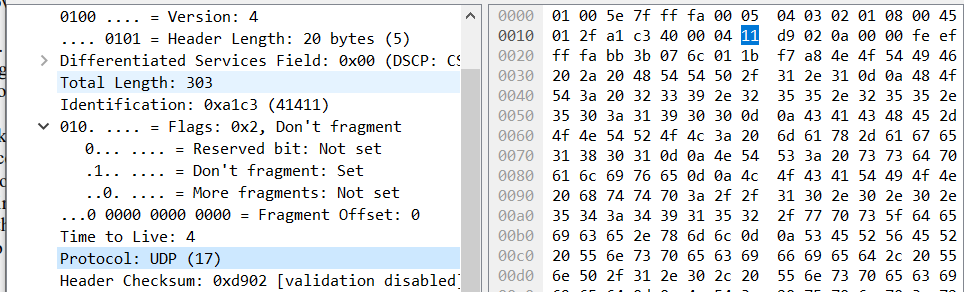

# Jarkom-Modul-Hands-On
Perkenalkan saya dari kelas ``Jaringan Komputer D Kelompok  D17``,:

| Nama                      | NRP        |
|---------------------------|------------|
|Ahda Filza Ghaffaru        | 5025211144 |

## No 1

1. What is the IP address and TCP port number used by the client computer (source) that is transferring the alice.txt file to gaia.cs.umass.edu?

Untuk mendapatkan IP address dan Port TCP-nya, kita hanya perlu melakukan filtering menggunakan kata kunci "http", sehingga didapatkan sebagaimana berikut.

Answer: Source IP Adress is 192.168.86.68 and Source Port is 55639

## No 2

2. What is the IP address of gaia.cs.umass.edu? On what port number is it sending and receiving TCP segments for this connection

Berdasarkan gambar pada nomor 1, dapat diketahui bahwa,

Answer: Dst IP Adress is 128.119.245.12 and Dst Port is 80

## No 3

3. What is the sequence number of the TCP SYN segment that is used to initiate the TCP connection between the client computer and gaia.cs.umass.edu?

Berdasarkan filtering yang dilakukan pada screenshot, yakni penggunaan ``tcp.flags.syn`` DAN ``ip.dst``

didapatkan bahwa 

Answer: Sequence Number (raw) : 4236649187

## No 4

4. What is the sequence number of the SYNACK segment sent by gaia.cs.umass.edu to the client computer in reply to the SYN? What is it in the segment that identifies the segment as a SYNACK segment? What is the value of the Acknowledgement field in the SYNACK segment? How did gaia.cs.umass.edu 
determine that value? 

Untuk mencari sequence number dari SYNACK segment yang DIKIRIM oleh gaia.cs, kita perlu melakukan filtering yakni ``tcp.flags.syn``, ``tcp.flags.ack`` dan ``ip.src``,

Sehingga didapatkan,

Answer: 
- Sequence number (raw) : 1068969752
- The flags number : 0x012 identifies the SYNACK segment
- Acknowledgment Number (raw) : 4236649188

## No 5

5. What is the sequence number of the TCP segment containing the header of the HTTP POST command ?

Berdasarkan gambar screenshot, didapatkan bahwa sequence number (RAW) adalah
Answer: 4236801228

## No 6

At what time was the first segment (the one containing the HTTP POST) in the data-transfer part of the TCP connection sent?

Dengan packet number yang sama pada nomor 5, didapatkan bahwa arrival time adalah sebagaimana berikut

## No 7

7.  What is the length (header plus payload) of each of the first four data-carrying TCP segments?

Untuk melihat length header + payload, pada paket yang sama dapat dilihat bahwa,

Answer: 1451 Bytes (11608 bits)

## Soal UDP

## Nomor 1

1. Select the first UDP segment in your trace. What is the packet number of this segment in the trace file? What type of application-layer payload or protocol message is being carried in this UDP segment ?  How many fields there are in the UDP header?

Berdasarkan gambar tersebut, didapatkan bahwa

Answer: Packet Number 5 and there are 4 Fields in the UDPHeader.

## Nomor 2

2. By consulting the displayed information in Wireshark’s packet content field for this packet (or by consulting the textbook), what is the length (in bytes) of each of the UDP header fields?

Berdasarkan UDP Header pada gambar yang sama pada nomor 1, didapatkan bahwa length dari masing-masing UDPHeader fields adalah 2 bytes (2 blok biru pada bagian kanan bawah) x 4 (ada 4 field) = 8 bytes.

## Nomor 3

The value in the Length field is the length of what? (You can consult the text for this answer). Verify your claim with your captured UDP packet. 

Dari screenshot tersebut, dapat diketahui bahwa length adalah panjang dari prototype UDP di paket tersebut, bisa dilihat bahwa length nya adalah 283

## Nomor 4

What is the maximum number of bytes that can be included in a UDP payload? 

Answer:The maximum number of bytes that can be included in a UDP payload is (2^16 – 1) bytes plus the header bytes. This gives 65535 bytes – 8 bytes = 65527 bytes.

## Nomor 5

What is the largest possible source port number?

Karena pada soal nomor 4 didapat bahwa maximum number dari bytes di UDP Payload adalah 65535 - 8 Bytes, maka diketahui largest possible source port number adalah 65535

## Nomor 6

What is the protocol number for UDP? Give your answer in decimal notation

Berdasarkan gambar tersebut, didapatkan bahwa protocol number dari UDP adalah 17 (0x11)

## Nomor 7

Examine the pair of UDP packets in which your host sends the first UDP packet and the second UDP packet is a reply to this first UDP packet. (Hint: for a second packet to be sent in response to a first packet, the sender of the first packet should 
be the destination of the second packet).

What is the packet number of the first of these two UDP segments in the trace file? What is the packet number of the second of these two UDP segments in the trace file?

Answer: 
The pair is Packet 521 and 526

